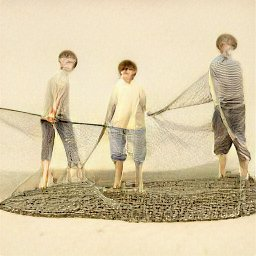

  

## Projet *Euclide* (FR)

### But

L'idée globale du projet *Euclide* est d'assister les étudiantes et étudiants dans la traduction de l'Anthologie Palatine. Cette intiative est née du colloque *Navigtion Anthologique* qui eut lieu à l'Université de Montréal du 27 au 29 octobre 2022. *Euclide* agit comme un dictionnaire lexical et sémantique des termes précis du corpus de l'Anthologie. En plus des termes grecs, on retrouve des concepts gramaticaux propres au corpus. *Euclide* accompagne de façon pédagogique et soutenu l'étudiante et l'étudiant tout au long de son processus de traduction en renoforcant le sentiment d'appartenance au texte. 

### Méthode

*Euclide* utilise un enssemble de donné organisé en chaine de caratères. Chaque distique constitue une chaine. Le vocabuliare inclue dans ces chaine est décortiqué à partir du LEM. Les récurence sont comptabilisé dans l'enssemble de donnés pour chaque distiques. On retrouve dans cet essemble, en plus des récurences, les règles gramaaticales qui s'appliquent et les thèmes extra-textuels.

L'algorythme créé à partir de cette base de données utilise une dynamique vectoriel de type "cosine matching" 
___

## Project Euclide (EN)

### Goal

The overall idea of the *Euclide* project is to assist students in the translation of the Palatine Anthology. This initiative was born out of the *Anthological Navigation* conference that took place at the University of Montreal from October 27 to 29, 2022. *Euclide* acts as a lexical and semantic dictionary of specific terms from the Anthology's corpus. In addition to the Greek terms, it includes grammatical concepts specific to the corpus. *Euclide* pedagogically guides and supports the student throughout the translation process by reinforcing the sense of belonging to the text. 

### Method

*Euclide* uses a set of data organized in strings of characters. Each phrase constitutes a string. The vocabulary included in these strings is deconstructed from the lemma The recurrences are counted in the data set for each phrase. In addition to the recurrences, this dataset contains the grammatical rules that apply and the extra-textual themes.

The algorithm created from this database uses a dynamic vector "cosine matching" type
___

## Progetto Euclide (IT)

### Obiettivo

L'idea generale del progetto *Euclide* è di assistere gli studenti nella traduzione dell'Antologia Palatina. Questa iniziativa è nata dalla conferenza *Navigtion Anthologique* che si è svolta all'Università di Montreal dal 27 al 29 ottobre 2022. *Euclide* funge da dizionario lessicale e semantico di termini specifici del corpus dell'Antologia. Oltre ai termini greci, troviamo concetti grammaticali specifici del corpus. *Euclide* accompagna lo studente durante tutto il processo di traduzione in modo pedagogico e solidale, rafforzando il senso di appartenenza dello studente al testo. 

### Metodo

*Euclide* utilizza un insieme di dati organizzati in una stringa di caratteri. Ogni distico costituisce una stringa. Il vocabolario incluso in queste stringhe è decostruito dal lemma. Le ricorrenze vengono contate nel set di dati per ogni frase. Oltre alle ricorrenze, questo dataset contiene le regole grammaticali applicabili e i temi extra-testuali.

L'algoritmo creato da questo database utilizza un vettore dinamico di tipo "cosine matching".